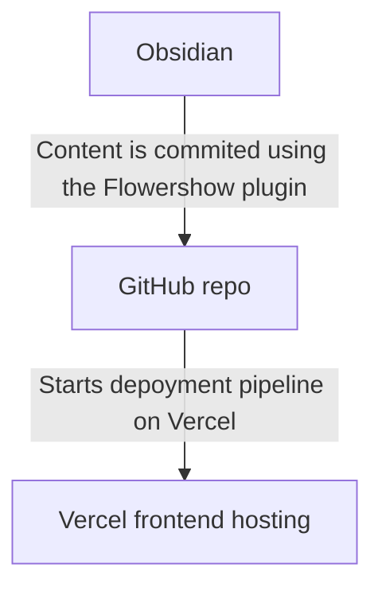

## Requirements  
  
### Markdown compatible  
  
I'm a software engineer and geek who spends a lot of time writing code. One thing I truly dislike is WYSIWYG editors. **Markdown** is a blessing from God, and I believe every text editor should support it.   
  
#### Obsidian integration  
  
I use [Obsidian](obsidian.md) for storing my work and personal notes on my computer. If you're not familiar with Obsidian, I highly recommend googling it to learn more. I switched from [Notion](https://www.notion.so/) to [Obsidian](obsidian.md) and have been happy with the change.  

I'm looking for an **easy way to share my posts from Obsidian** with the public.
### Simplicity  
  
My friend once asked me how to distinguish between a good and a bad developer. My reply was:
  
> The quantity of idioms or patterns you know is irrelevant if you cannot write clear and straightforward code that your teammates can easily comprehend and maintain. Simplicity is crucial in coding.
  
So, **simplicity** is another requirement. It is highly valuable for me!  
  
### Free & self-hosted  
  
I had blogs on different platforms, but some got discontinued, resulting in the loss of all my data. I prefer a **free and reliable** blog solution without depending on third-party vendors or paying for it.  
  
### Getting Feedback  
  
It would be great to have the ability to receive **comments** from people. Feedback is always motivating and encourages me to share more content.  

### RSS Support

Having an **RSS feature** is important for a blog. Personally, I use RSS aggregators like Feedly to read blog content. While platforms like Twitter and Telegram channels have gained popularity for notifying about updates, I still believe having an RSS feature is beneficial. It's a plus if it's available, but if not, I can consider adding it later. However, for that, the tool should be **open-source**.
## Solutions  

I'm searching for solutions that meet the following criteria:

-  Compatible with Obsidian
-  Simple
-  Free
-  Reliable
-  Support comments
-  Support RSS feeds
- Open-source

I will overview the following solutions:

1. [Obsidian Publish](https://obsidian.md/publish)  
2. Obsidian + [Flowershow](https://flowershow.app/) + [Vercel](https://vercel.com)   
3. Obsidian + [Jekyll](https://jekyllrb.com/) + Github Pages  
  
### [Obsidian Publish](https://obsidian.md/publish)  

URL: https://obsidian.md/publish

- ✅ Compatible with Obsidian 
- ✅ Simple
- ⛔ Free
- ✅ Reliable
- ⛔ Support comments
- ⛔ Support RSS feeds
- ⛔ Open-source
  
The easiest way to share your content from Obsidian is through Obsidian Publish. It has a user-friendly design, but it does come with a monthly subscription fee of $10. Personally, I find it a bit expensive. If it offered features like comments, RSS, and subscriptions, the price would be more reasonable. I'm currently seeking a free alternative. Nonetheless, it's generally appealing, although it's not ideal for blogging — just for quickly sharing your notes.
  
#### Pros:   
  
- Publishing from Obsidian is easy (but has limitations)  
  
#### Cons:  
  
- Publishing single pages can be complicated due to the manual handling of assets (attachments) on each page. When I needed to publish a page with images, I had to individually select and publish each image from my images folder along with the page. This process can be quite annoying, especially when there are multiple images in my post.
- Paid.
- Commenting is disabled.
- It's not possible to add required features like RSS and commenting because the software is not open source.

### Obsidian + [[Flowershow]] + [Vercel](https://vercel.com)  

URL: https://flowershow.app/

- ✅ Compatible with Obsidian
- ✅ Simple
- ✅ Free
- ⛔ Reliable
- ✅ Support comments
- ⛔ Support RSS feeds
- ✅ Open-source

[Flowershow](https://flowershow.app/) is a frontend app that renders Obsidian vault pages. It's a relatively new project specifically designed specially for rendering Obsidian pages. You can easily deploy it to [Vercel](https://vercel.com) where it is available for free, with limitations on the number of redeployments allowed on the Free plan.  
  

The project is currently being actively developed by only one developer, according to repo Insights. Hopefully, it will not be shut down as it appears to have potential.

![[assets/Flowershow1.png]]
![[assets/Pasted image 20230911014605.png]]
#### Pros:  
  
- Publishing pages is easy (it has a plugin for Obsidian), and deploying a new blog from scratch is also relatively simple.  
- The free version of [Vercel](https://vercel.com) is sufficient for personal use. So hosting is free.
- Attachments (images) on the page are automatically handled, so there are no issues with publishing individual pages.
- Built-in [tailwind](https://tailwindcss.com/) support. You can use it to style your custom layouts or in-markdown HTML blocks.
  
#### Cons:  
  
- It's a new project, so there could be bugs. The community is very small with only 485 ⭐ on GitHub, which doesn't seem reliable.
- There is no RSS, but it's open source.

### Obsidian + [Jekyll](https://jekyllrb.com/) + Github Pages  

- ⛔ Compatible with Obsidian
- ✅ Simple
- ✅ Free
- ✅ Reliable
- ✅ Support comments
- ✅ Support RSS feeds
- ✅ Open-source
    
[[Jekyll]] is a popular open-source tool that converts your Markdown text into static web pages and publishes them on the web. It can be conveniently hosted on GitHub pages, providing free hosting for your blog.  
  
#### Pros:  
  
- It's written in Ruby ❤️ and includes useful plugins such as comments and RSS. It has a large community with 47.2k ⭐ on GitHub.  
- Easily deploy to GitHub Pages with built-in support. For free.
#### Cons:  
  
- There is currently no direct connector between Obsidian and Jekyll. To publish Obsidian pages with Jekyll, pre-processing is required. This involves tasks such as storing images as assets and pre-processing links. So posting pipeline will be manual and complicated. 
  
## Summary  
  
[Jekyll](https://jekyllrb.com/) is a more reliable solution and enjoys greater popularity. However, it does not currently have integration with Obsidian. I haven't heard much about [Flowershow](https://flowershow.app/), so I hope they won't abandon the project as it feels a bit unfinished at the moment. I have encountered some bugs, but they were not critical.

If I have more free time, I will choose [Jekyll](https://jekyllrb.com/) and develop a plugin for Obsidian. However, for now, I have decided to give [Flowershow](https://flowershow.app/) a chance. Flowershow is built on React and Next.js, so contributing to this project may not be as fulfilling for me as working with Ruby, which I love. Nonetheless, Flowershow offers almost all the features I need without requiring additional coding. Since this project is marketed as a no-code solution, I don't expect to make any code modifications.

Anyway, I will share my experience of using [[Flowershow]] after a while.