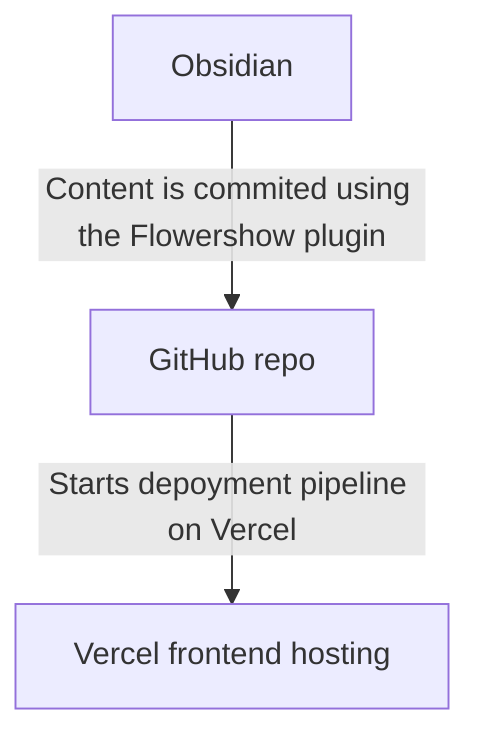

## Requirements  
  
### Markdown compatible  
  
I'm a software engineer and geek who spends a lot of time writing code. One thing I truly dislike is WYSIWYG editors. **Markdown** is a blessing from God, and I believe every text editor should support it.   
  
#### Obsidian integration  
  
I use [Obsidian](obsidian.md) for storing my work and personal notes on my computer. If you're not familiar with Obsidian, I recommend googling it to learn more. I switched from [Notion](https://www.notion.so/) to [Obsidian](obsidian.md) and have been happy with the change.  
  
I'm looking for an **easy way to share my posts from Obsidian** with the public.  
  
### Simplicity  
  
My friend once asked me how to distinguish between a good and a bad developer. My reply was:  
  
> The number of idioms or patterns you know doesn't matter if you can't write clean and simple code that your team's developers can easily understand and maintain. It's one of the most important aspects.  
  
So, **simplicity** is another requirement. It is highly valuable for me!  
  
### Free & self-hosted  
  
I had blogs on different platforms, but some got discontinued, resulting in the loss of all my data. I prefer a **free and reliable** blog solution without depending on third-party vendors or paying for it.  
  
### Getting Feedback  
  
It would be great to have the ability to receive **comments** from people. Feedback is always motivating and encourages me to share more content.  
  
## Solutions  
  
1. [Obsidian Publish](https://obsidian.md/publish)  
2. Obsidian + [Flowershow](https://flowershow.app/) + [Vercel](https://vercel.com)   
3. Obsidian + [Jekyll](https://jekyllrb.com/) + Github Pages  
  
### [Obsidian Publish](https://obsidian.md/publish)  
  
The easiest method to publish your content from Obsidian is through the [Obsidian Publish](https://obsidian.md/publish) feature. It has a clean and attractive design, but it is a paid solution. It costs $10 per month, which is not overly expensive. However, I am seeking a free alternative. Nonetheless, it is quite appealing overall.  
  
#### Pros:   
  
- Publishing from Obsidian is easy (but has limitations)  
  
#### Cons:  
  
- Publishing single pages can be complicated due to the manual handling of assets (attachments) on each page. When I needed to publish a page with images, I had to individually select and publish each image from my images folder along with the page. This process can be quite annoying, especially when there are multiple images in my post.  
- Paid  
- Commenting is disabled.  
  
### Obsidian + [Flowershow](https://flowershow.app/) + [Vercel](https://vercel.com)  
  
[Flowershow](https://flowershow.app/) is a frontend app that renders Obsidian vault pages. It's a relatively new project specifically designed specially for rendering Obsidian pages. You can easily deploy it to [Vercel](https://vercel.com) where it is available for free, with limitations on the number of redeployments allowed on the Free plan.  
  

  
#### Pros:  
  
- Publishing pages is easy (it has a plugin for Obsidian), and deploying a new blog from scratch is also relatively simple.  
- The free version of [Vercel](https://vercel.com) is sufficient for personal use.  
- Attachments (images) on the page are automatically handled, so there are no issues with publishing individual pages.  
  
#### Cons:  
  
- `¯\_(ツ)_/¯`  
- It's a new project, so there could be bugs  
  
### Obsidian + [Jekyll](https://jekyllrb.com/) + Github Pages  
  
[[Jekyll]] is a popular open-source tool that converts your Markdown text into static web pages and publishes them on the web. It can be conveniently hosted on GitHub pages, providing free hosting for your blog.  
  
#### Pros:  
  
- It is written in Ruby ❤️ and has a variety of useful plugins: comments, rss, etc.  
- Easily deploy to GitHub Pages with built-in support  
#### Cons:  
  
- There is currently no direct connector between Obsidian and Jekyll. To publish Obsidian pages with Jekyll, pre-processing is required. This involves tasks such as storing images as assets and pre-processing links. So posting pipeline will be manual and complicated.  
  
## Summary  
  
If I prefer a traditional-style blog instead of using Obsidian, I would choose Jekyll. However, I have chosen to use a combination of **Obsidian, Flowershow, and Vercel**. Flowershow is based on React and Next.js, so contributing to this project may not be as satisfying for me as working with Ruby (which I love). Nevertheless, Flowershow offers nearly all the features I require without requiring additional coding. Since this project is marketed as a no-code solution, I do not expect to make any code modifications.